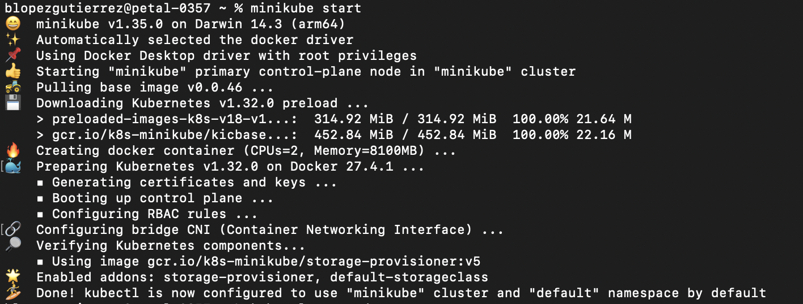
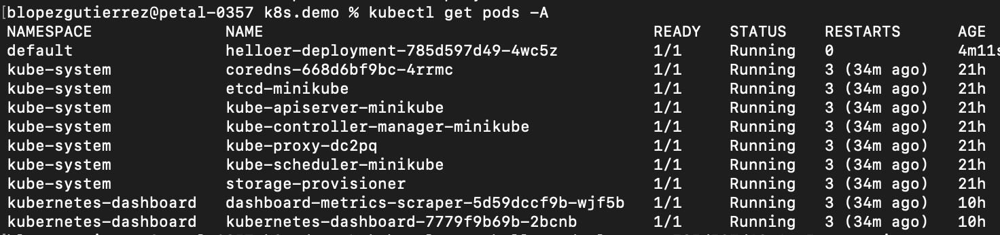
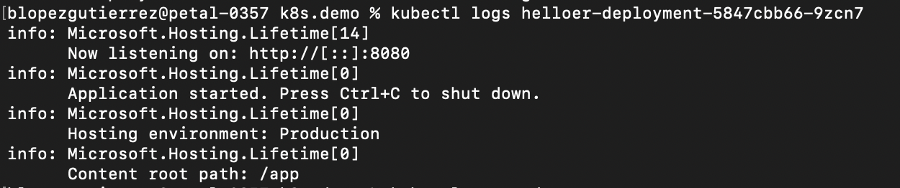
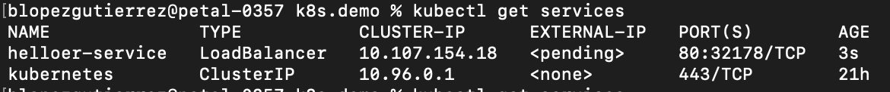
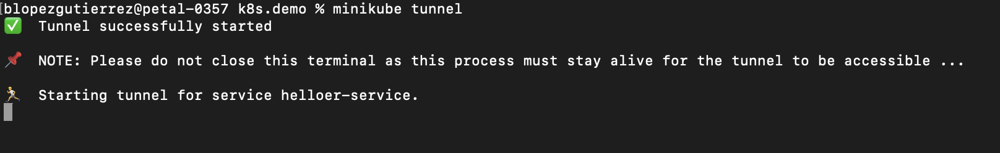
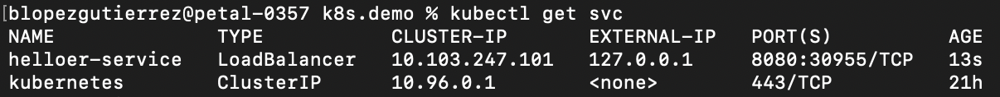
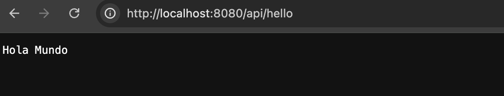

# OPERATOR
[Setup Local Kubernetes Cluster](#how-to-install-set-up-and-configure-a-kubernetes-cluster)

- [Prerequisites](#installing-prerequisites)
- [Setting up cluster](#setting-up-cluster)
- [Deployment](#creating-and-applying-a-deployment)
- [Service](#creating-a-kubernetes-service-to-expose-our-already-deployed-image-in-a-pod)

[Troubleshooting](#troubleshooting)

## How to install, set up and configure a kubernetes cluster
Before getting started, I must clarify that for this guide, I'm running it from Mac (Apple M2), and homebrew. Other setups (including OS and package managers) will not be covered in this document.

### Installing prerequisites
**- Docker Desktop**

Go to [download](https://docs.docker.com/desktop/setup/install/mac-install/) in Docker Desktop and follow instructions to download and install. Once installed, run it.

**- Kubernetes CLI / Kubectl**
 
```console
brew install kubernetes-cli
 ```
 or

 ```console
 brew install kubectl
 ```
 **- Minikube**
 ```console
brew install minikube
 ```
 **Note:** Minikube requires kubernetes-cli but the brew install commands has the ability to install it by itself. (I make this visible in case this works different for other package managers/OS)

### Setting up Cluster
 ```console
minikube start
 ```


**Note:** Minikube's job at this point is limited to fire up the cluster, once it's started we are now able to start running kubectl commands.

 ```console
kubectl get pods -A
 ```

 A list of *running* **pods** will demonstrate that minikube and kubectl are working as expected, and it should look like this:
 

### Creating and applying a deployment
In order to start executing kubectl commands, we are gonna need a placeholder for manifests and configuration.

**Environment setup**

From your terminal run
```terminal
code .
```
which will run Visual Studio Code, once in there create a new file and name it *helloer-deployment.yaml*

**Deployment manifest**
```yaml
apiVersion: apps/v1
kind: Deployment
metadata:
  name: helloer-deployment
  labels:
    app: helloer
spec:
  replicas: 1
  selector:
    matchLabels:
      app: helloer
  template:
    metadata:
      labels:
        app: helloer
    spec:
      containers:
      - name: helloer
        image: benswengineer/helloer
        ports:
        - containerPort: 80

 ```
 **Applying this manifest to our kubernetes cluster**

 To execute this order, we need to run from our terminal:
 ```console
kubectl apply -f helloer-deployment.yaml
 ```
**Validate deployment**

Run again

```console
kubectl get pods -A
 ```

It should look like this: (now including a new pod deploying the image specified in our deployment yaml file)


**Valudate image logs**

Run

```console
kubectl logs helloer-deployment-785d597d49-4wc5z
 ```

And it should look like this:


**Note:** Since the image we are using comes from a NetCore API, the logs shown in previous image represent the classic initialization logs for that technology.

### Creating a kubernetes service to expose our already deployed image in a pod.
Despite having evidence (logs from a pod)of our deployed app (in this case an API), we are still unable to use the software we have deployed using kubernetes, right? In order to do it, we need to create a bridge between the cluster/pod and the host. This bridge is actually called a **kubernetes service**.
```console
kubectl expose deployment helloer-deployment --type=LoadBalancer --name=helloer-service
```
to validate this command, we need to check our services
```console
kubectl get services
```

**Note:** If we check this details, we will find an external-IP column that appears to be *pending*. This is expected, becase we are exposing from the inside, but up to this point we have not asked **minikube** to allow this bridge communication, let's do that now.

From a new terminal run:
```console
minikube tunnel
```

**Note:** It's primordial to run this in a new terminal, since minikube will only enable the tunnel for as long as the terminal window lives.

**Validating our service**

If we run again:
to validate this command, we need to check our services
```console
kubectl get services
```

Now we get:

External-Ip = 127.0.0.1 and 
PORT = 8080 means http:localhost:8080, right?

so if we run 

```console
curl http://localhost:8080/api/hello
```

we finally get
```console
Hola Mundo
```
same results from the browser


And that's how you can install, set up and configure a kubernetes cluster for development purposes.

## Troubleshooting

**If we made a mistake creating our deployment, we could delete it and recreate it**

delete pod by name
```console
delete pod <pod_name>
```
**if we made a mistake creating our service, we could delete it and recreate it**

delete service by name
```console
delete service <service_name>
```