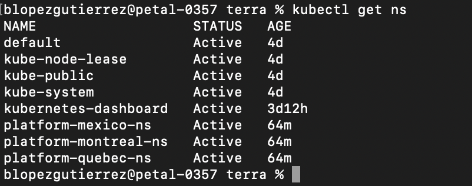

# Interacting with the repository to create and manage their namespaces.

## Deployment Context
Within our Terraform deployment we have created several objects, including: namespaces, roles, role bindings and deployments.

### Namespaces
Namespaces created from terraform deployment:
* platform-montreal-ns
* platform-mexico-ns
* platform-quebec-ns

If we run:
```console
kubectl get ns
 ```

 We get:
 

 **Purpose**

The purpose for those namespaces rely on the requirement of a software company that allocates software developers in 3 cities: Quebec, Montreal and Mexico.
When a developer is hired, depending on their role, they will have access to different namespaces, this will be described next.
#### How to create a new namespace?
**Using kubectl command**
```console
kubectl create namespace my-namespace
 ```

 **Using terraform**
 ```terraform
resource "kubernetes_namespace" "example" {
  metadata {
    annotations = {
      name = "example-annotation"
    }

    labels = {
      mylabel = "label-value"
    }

    name = "terraform-example-namespace"
  }
}
 ```
 ```console
terraform import kubernetes_namespace.example terraform-example-namespace
 ```

 **Note:** When using import, terraform accepts the request for a new namespace, affecting the terraform state, but it does not update the .tf manifest, this has to be done manually.
### RBAC Implementation
The RBAC implementation deployed within the existing terraform manifest described the next 3 roles:
* junior-dev-role
    
    It has [list, get] permissions against [pods] objects
* senior-dev-role
   
   It has [list, get] permissions against [pods, deployments] objects
* lead-dev-role

    It has [list, get, create, delete] permissions against [pods, deployments, services, secrets] objects


For demo purposes, I have implemented the next bindings:
* **junior-dev-role** has access to the namespaces: **[platform-quebec-ns]**
* **senior-dev-role** has access to the namespaces: **[platform-montreal-ns, platform-mexico-ns]**
* **lead-dev-role** has access to the namespaces: **[platform-montreal-ns, platform-mexico-ns, platform-quebec-ns]**

In the same way, the current manifest describes 3 users:
* Max (senior dev)
* Jamie (junior dev)
* Ben (lead dev)

Finally, the mix of namespaces + roles + bindings + users shoud correspond to this:

### Deployments

